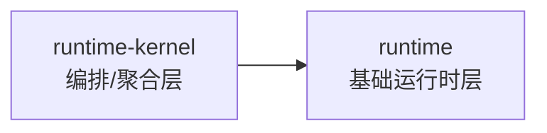

# 项目全景调用图（Project Flow Map）

本文用于快速回答三个问题：

1. 前端某个页面走哪些后端接口？
2. 后端某个接口落到哪个 Controller/Service？
3. 关键业务数据落在哪些表？

## 1. 端到端链路（总览）

```text
Browser (React/Vite)
  -> App Runtime (route/page loader)
  -> fetch /api or /api/v1 or /api/v2
  -> Spring Controller
  -> Service (business orchestration)
  -> Repository (JPA)
  -> MySQL tables (Flyway V1~V20)
```

### 1.1 `runtime` / `runtime-kernel` 单向依赖

这条关系是前端分层里最容易被误解的地方，这里单独列出来，避免二次开发时把依赖方向写反。



- 允许：`runtime-kernel -> runtime`
- 不允许：`runtime -> runtime-kernel`
- 原则：上层只负责组合、收口和对外导出，不把下层能力反向耦合回去。

补充：

- 认证：`Authorization: Bearer <token>` + `X-Tenant-Id`
- 多租户：多数 v1/v2 接口在服务层做 tenant 过滤
- 可观测：`AuditLogService` 在关键写操作记录审计日志

## 2. 前端页面 -> 路径 -> 后端域

来源：`apps/web/src/crm/hooks/orchestrators/runtime/routeConfig.js`

| 页面键 | 路径 | 主要后端域 |
|---|---|---|
| `dashboard` | `/dashboard` | `/api/dashboard`, `/api/v1/reports/*`, `/api/v1/workbench/*` |
| `leads` | `/leads` | `/api/v1/leads/*`, `/api/v1/leads/assignment-rules/*` |
| `customers` | `/customers` | `/api/customers*`, `/api/contacts*`, `/api/follow-ups*` |
| `pipeline` | `/opportunities` | `/api/opportunities*`, `/api/tasks*` |
| `products` | `/products` | `/api/v1/products*`, `/api/v1/price-books*` |
| `quotes` | `/quotes` | `/api/v1/quotes*`, `/api/v1/orders*` |
| `orders` | `/orders` | `/api/v1/orders*`, `/api/v1/contracts*`, `/api/v1/payments*` |
| `contracts` | `/contracts` | `/api/contracts*`, `/api/v1/contracts*` |
| `payments` | `/payments` | `/api/payments*`, `/api/v1/payments*` |
| `approvals` | `/approvals` | `/api/v1/approval/*`, `/api/v1/integrations/notifications/*` |
| `reportDesigner` | `/reports/designer` | `/api/v1/reports/designer/*`, `/api/v2/charts/*` |
| `reports` | `/reports` | `/api/reports/*`, `/api/v1/reports/*` |
| `audit` | `/audit` | `/api/audit-logs*` |
| `permissions` | `/admin/permissions` | `/api/permissions/*`, `/api/v2/compliance/*` |
| `usersAdmin` | `/admin/users` | `/api/admin/users*`, `/api/v1/admin/users*` |
| `adminTenants` | `/admin/tenants` | `/api/v1/tenants*`, `/api/v2/tenant-config` |

## 3. API 域 -> Controller -> Service -> 主要表

> 下面是高频主链路，便于定位问题；不是每个接口的穷举表。

### 3.1 认证与租户

| API 域 | Controller | 主要 Service | 主要表 |
|---|---|---|---|
| `/api/auth/*`, `/api/v1/auth/*` | `AuthController`, `V1AuthController` | `TokenService`, `LoginRiskService`, `MfaService`, `SsoAuthService` | `user_accounts`, `user_invitations`, `tenants` |
| `/api/v1/tenants*`, `/api/v2/tenant-config` | `V1TenantController`, `V2TenantConfigController` | 审计/配置相关服务 | `tenants` |

### 3.2 客户与销售流程

| API 域 | Controller | 主要 Service | 主要表 |
|---|---|---|---|
| `/api/customers*` | `CustomerController` | 审计 + 数据规范化 | `customers` |
| `/api/contacts*` | `ContactController` | 审计 | `contacts` |
| `/api/follow-ups*` | `FollowUpController` | 审计 + 数据规范化 | `follow_ups` |
| `/api/opportunities*` | `OpportunityController` | 审计 + 数据规范化 | `opportunities` |
| `/api/tasks*` | `TaskController` | 审计 | `tasks` |
| `/api/v1/leads*` | `V1LeadController` | `LeadImportService`, `LeadAssignmentService`, `LeadAutomationService` | `leads`, `lead_assignment_rules`, `lead_import_jobs*` |

### 3.3 商业化（报价/订单/合同/回款）

| API 域 | Controller | 主要 Service | 主要表 |
|---|---|---|---|
| `/api/v1/products*`, `/api/v1/price-books*`, `/api/v1/quotes*`, `/api/v1/orders*` | `V1CommerceController` | `CommerceFacadeService` | `products`, `price_books`, `price_book_items`, `quotes`, `quote_items`, `quote_versions`, `order_records` |
| `/api/contracts*` | `ContractController` | 审计 + 规范化 | `contracts` |
| `/api/payments*` | `PaymentController` | 审计 + 规范化 | `payments` |

### 3.4 审批与协作

| API 域 | Controller | 主要 Service | 主要表 |
|---|---|---|---|
| `/api/v1/approval/*` | `V1ApprovalController` | `ApprovalSlaService`, `ApprovalTemplateVersionService` | `approval_templates*`, `approval_instances`, `approval_tasks`, `approval_events`, `approval_nodes` |
| `/api/v2/collaboration/*` | `CollaborationController` | `CollaborationService`, `ApprovalDelegationService` | `comments`, `activity_shares`, `teams`, `field_permissions` |
| `/api/v1/integrations/notifications/*` | `V1NotificationJobController` | `NotificationJobService` | `notification_jobs`, `notification_channels` |

### 3.5 报表、图表、搜索、工作流

| API 域 | Controller | 主要 Service | 主要表 |
|---|---|---|---|
| `/api/reports/*`, `/api/v1/reports/*` | `ReportController`, `V1ReportController` | `ReportAggregationService`, `ReportExportService`, `ReportUtils`, `ReportExportJobService` | 聚合多业务表 + 导出作业表 |
| `/api/v1/reports/designer/*` | `V1ReportDesignerController` | 模板查询 + 审计 | `report_designer_templates` |
| `/api/v2/charts/*` | `ChartController` | `ChartService` | `chart_templates` |
| `/api/v2/search/*`, `/api/v2/filters/*` | `SearchController`, `QuickFilterController` | `GlobalSearchService` | `saved_searches`, `search_index`, `quick_filters` |
| `/api/v2/workflows/*` | `WorkflowController` | `WorkflowService`, `WorkflowExecutionService` | `workflow_definitions`, `workflow_nodes`, `workflow_connections`, `workflow_executions` |

## 4. 集成发送链路（企微/钉钉/飞书）

发送主链路：

```text
业务触发 -> NotificationDispatchService / NotificationJobService / MessagePushService
         -> IntegrationWebhookService
            -> WECOM webhook / DINGTALK webhook / FEISHU App API or webhook
```

关键文件：

- `apps/api/src/main/java/com/yao/crm/service/IntegrationWebhookService.java`
- `apps/api/src/main/java/com/yao/crm/service/NotificationJobService.java`
- `apps/api/src/main/java/com/yao/crm/service/MessagePushService.java`
- `apps/api/src/main/java/com/yao/crm/service/NotificationDispatchService.java`

## 5. 快速排查指南（按问题类型）

### 5.1 页面数据不刷新/为空

1. 看前端当前路径是否在 `routeConfig.js` 有映射
2. 看浏览器请求是否带 `Authorization` 与 `X-Tenant-Id`
3. 对照本文第 3 节定位对应 Controller/Service

### 5.2 API 200 但业务未生效

1. 检查 `AuditLogService` 是否有对应记录
2. 检查目标租户是否正确（tenantId）
3. 检查实体表是否写入（第 3 节“主要表”）

### 5.3 通知发送失败

1. 先跑：`powershell -ExecutionPolicy Bypass -File scripts/test-webhooks.ps1`
2. 看 `FEISHU_APP` / `WECOM` / `DINGTALK` 哪一路失败
3. 检查 `.env.backend.local` 和 `notification_channels.config_json`

## 6. 推荐阅读顺序（新同学）

1. `README.md`
2. 本文 `docs/PROJECT_FLOW_MAP.md`
3. `docs/operations/command-reference.md`
4. `apps/api/src/main/java/com/yao/crm/controller/`（按域阅读）
5. `apps/web/src/crm/hooks/orchestrators/runtime/routeConfig.js`

---

如果你要做二次开发，建议先从一个闭环开始（例如“线索导入 -> 线索列表 -> 指派 -> 审批通知”），按本文映射逐段断点调试，效率最高。
