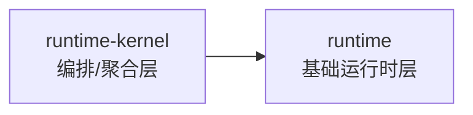

# CRM 项目结构 | CRM Project Structure

---

## 根目录 | Root

| 目录 | 中文 | English |
|------|------|---------|
| `apps/api/` | Spring Boot 后端 (REST API, 认证, 角色权限, 报表, 导出) | Spring Boot backend (REST API, auth, role permissions, reports, exports). |
| `apps/web/` | React 前端 | React frontend. |
| `scripts/` | 本地辅助脚本 (数据库初始化, API 冒烟, 本地 E2E) | local helper scripts (DB init, API smoke, local e2e). |
| `packages/` | 共享包占位 (未来提取) | shared packages placeholder (future extraction). |
| `docs/` | 项目文档 | project documentation. |
| `docs/README.md` | 文档导航索引 | docs navigation index. |
| `docs/operations/` | 活跃运维手册和策略 | active operational runbooks and policies. |
| `docs/operations/archive/` | 历史发布和执行记录 | historical release and execution records. |

---

## 前端 (`apps/web/src`) | Frontend (`apps/web/src`)

| 文件/目录 | 中文 | English |
|-----------|------|---------|
| `App.jsx` | 应用状态编排, API 调用, 认证流程, 数据加载器 | app state orchestration, API calls, auth flow, and data loaders. |
| `App.css` | 全局样式和组件级视觉规则 | global styles and component-level visual rules. |
| `crm/i18n.js` | 中英文翻译字典 | Chinese/English translation dictionary. |
| `crm/shared/` | 共享基础模块子目录 (constants, formatters, storage, http) | shared base modules subdirectory (constants, formatters, storage, http). |
| `crm/shared.js` | 共享模块统一出口 | unified export entry for shared modules. |
| `crm/components/` | UI 组件，按 `pages/`、`pages/<domain>/`、`pages/<domain>/sections` 分层组织 | UI components, layered by `pages/`, `pages/<domain>/`, and `pages/<domain>/sections`. |
| `crm/hooks/` | 自定义 Hooks（含 `hooks/api/` 分层的 `useXxxApi`，以及 `hooks/orchestrators/` 统一导出入口） | Custom hooks (including layered `useXxxApi` under `hooks/api/` and a unified export entry under `hooks/orchestrators/`). |
| `crm/store/` | Zustand 状态管理 | Zustand state management |
| `crm/components/pages/` | 页面域统一采用 `index.js` 域入口，配合各域下的 `sections.js` / `sections/` 做分层收口；`components/pages/index.js` 负责静态导出导航入口。目录命名持续对齐业务域，如 `follow-ups/`、`price-books/`。 | page domains use `index.js` as the domain entry, with `sections.js` / `sections/` under each domain as the layering boundary; `components/pages/index.js` provides the static export navigation entry. Directory names continue aligning with business domains such as `follow-ups/` and `price-books/`. |

### 页面组件 | Page Components

| 组件 | 中文 | English |
|------|------|---------|
| `LoginView.jsx` | 登录/注册/SSO 界面 | login/register/SSO UI. |
| `SidebarNav.jsx` | 分组导航和角色信息 | grouped navigation and role info. |
| `MainContent.jsx` | 页面组合层 (传递分组属性到面板) | page composition layer (passes grouped props to panels). |
| `pages/DashboardPanel.jsx` | 仪表板 | Dashboard panel |
| `pages/PermissionsPanel.jsx` | 权限管理 | Permissions panel |
| `pages/AuditPanel.jsx` | 审计日志 | Audit log panel |
| `pages/CustomersPanel.jsx` | 客户管理 | Customers panel |
| `pages/PipelinePanel.jsx` | 销售管道 | Pipeline panel |
| `pages/FollowUpsPanel.jsx` | 跟进管理 | Follow-ups panel |
| `pages/ContactsPanel.jsx` | 联系人管理 | Contacts panel |
| `pages/ContractsPanel.jsx` | 合同管理 | Contracts panel |
| `pages/PaymentsPanel.jsx` | 支付管理 | Payments panel |
| `pages/TasksPanel.jsx` | 任务管理 | Tasks panel |

### 页面域入口与 sections 收敛 | Page Domain Entry and Section Convergence

| 业务域 | 中文 | English |
|------|------|---------|
| `dashboard/` | `index.js` 作为域入口，`sections.js` 统一导出 `Stats`、`Workbench`、`Reports`、`AiFollowUpSummary`、`ReportExportJobs` 等 section，面板层只消费域级聚合结果。 | `index.js` is the domain entry, and `sections.js` centrally exports sections such as `Stats`, `Workbench`, `Reports`, `AiFollowUpSummary`, and `ReportExportJobs`; the panel layer only consumes the domain-level aggregate. |
| `leads/` | `index.js` 作为域入口，`sections.js` 收口列表、导入等 section，面板层不直接分散引用内部片段。 | `index.js` is the domain entry, and `sections.js` converges list/import sections so the panel layer does not reference internal fragments directly. |
| `pipeline/` | `index.js` 作为域入口，`sections.js` 统一承接管道列表与相关 section 的对外导出。 | `index.js` is the domain entry, and `sections.js` centralizes exports for the pipeline list and related sections. |
| `quotes/` | `index.js` 作为域入口，`sections.js` 统一收口报价列表、明细编辑等 section。 | `index.js` is the domain entry, and `sections.js` converges quote list and detail-edit sections. |
| `orders/` | `index.js` 作为域入口，`sections.js` 统一收口订单列表与编辑相关 section。 | `index.js` is the domain entry, and `sections.js` converges order list and editor-related sections. |
| `governance/` | `index.js` 作为域入口，`sections.js` 收口租户、用户、自动化等治理 section。 | `index.js` is the domain entry, and `sections.js` converges governance sections for tenants, users, and automation. |
| `approvals/` | `index.js` 作为域入口，`sections.js` 收口审批统计、任务、模板、节点配置、版本历史等 section。 | `index.js` is the domain entry, and `sections.js` converges approval stats, task, template, node-config, and version-history sections. |

---

## 后端 (`apps/api`) | Backend (`apps/api`)

| 目录 | 中文 | English |
|------|------|---------|
| `src/main/java/com/yao/crm/controller/` | 按领域划分的 REST 控制器 (34个) | REST controllers by domain (34). |
| `src/main/java/com/yao/crm/entity/` | JPA 实体 (31个) | JPA entities (31). |
| `src/main/java/com/yao/crm/repository/` | Spring Data 仓库 | Spring Data repositories. |
| `src/main/java/com/yao/crm/service/` | 领域服务和 i18n 支持 | domain services and i18n support. |
| `src/main/java/com/yao/crm/security/` | 认证和权限控制 | authentication and authorization. |
| `src/main/java/com/yao/crm/config/` | 跨领域配置（SecurityHeadersFilter, SecurityStartupValidator, MdcFilter, ServiceLoggingAspect, OpenApiConfig 等） | cross-cutting configuration (SecurityHeadersFilter, SecurityStartupValidator, MdcFilter, ServiceLoggingAspect, OpenApiConfig, etc.). |
| `src/main/java/com/yao/crm/exception/` | 业务异常体系（BusinessException 基类 + ErrorCode 枚举 + 业务异常子类） | business exception model (BusinessException base class, ErrorCode enum, and business exception subclasses). |
| `src/main/java/com/yao/crm/enums/` | 业务枚举（UserRole, DataScope, EntityStatus, ApprovalStatus, WorkflowStatus 等） | business enums (UserRole, DataScope, EntityStatus, ApprovalStatus, WorkflowStatus, etc.). |
| `src/main/java/com/yao/crm/event/` | 领域事件基础设施（DomainEvent, DomainEventPublisher, 业务事件, CacheInvalidationListener） | domain event infrastructure (DomainEvent, DomainEventPublisher, business events, CacheInvalidationListener). |
| `src/main/resources/` | 应用配置 | application config. |
| `src/main/resources/db/migration/` | Flyway 数据库迁移 | Flyway database migrations. |
| `src/test/java/` | 集成测试和单元测试 | integration and unit tests. |

---

## 前端分层架构 | Current Frontend Layering

| 层级 | 中文 | English |
|------|------|---------|
| 1 | `App.jsx`: 状态 + 副作用 + 权限 | `App.jsx`: state + side effects + permissions. |
| 2 | `MainContent.jsx`: 分组属性路由到页面面板 | `MainContent.jsx`: grouped props routing into page panels. |
| 3 | `pages/*.jsx`: 具体业务面板 (CRUD/报表/权限/审计) | `pages/*.jsx`: concrete business panels (CRUD/report/permissions/audit). |
| 4 | `hooks/api/*`: API domain 层（workflow, collaboration, approval, team, import/export；统一采用 `useXxxApi` 命名） | `hooks/api/*`: API domain layer (workflow, collaboration, approval, team, import/export; consistently named `useXxxApi`). |
| 5 | `hooks/orchestrators/`: 统一编排层入口，内部通过 `runtime` / `runtime-kernel` barrel 分层导出；依赖方向固定为 `runtime-kernel -> runtime`，禁止反向依赖 | `hooks/orchestrators/`: unified orchestration entry, internally exposed through `runtime` / `runtime-kernel` barrel exports; dependency direction is fixed as `runtime-kernel -> runtime`, and reverse dependency is forbidden. |
| 6 | `shared/` + `shared.js` + `i18n.js`: 可复用基础设施 | `shared/` + `shared.js` + `i18n.js`: reusable infra. |

### `runtime` / `runtime-kernel` 依赖约束 | `runtime` / `runtime-kernel` Dependency Constraint

这条链路只允许单向收口，用于保证基础能力先定义、上层编排后消费：

- `runtime`：承载更底层、可复用的运行时能力。
- `runtime-kernel`：在 `runtime` 之上做聚合、封装和对外输出。
- 允许：`runtime-kernel` 依赖 `runtime`。
- 不允许：`runtime` 反向依赖 `runtime-kernel`，避免形成环形依赖和分层倒挂。
- 约束目的：让基础能力保持稳定，上层实现可以替换、拆分或重构，而不会反向污染底层。

### 前端性能与构建优化 | Frontend Performance & Build Optimization

| 项 | 中文 | English |
|----|------|---------|
| 构建拆分 | 使用 Vite 将 `antd` 与 `echarts` 拆分为独立 chunk，减少首屏 bundle 体积，加快加载速度。 | Use Vite to split `antd` and `echarts` into dedicated chunks to reduce initial bundle size and improve load time. |
| 组件优化 | 对高频渲染组件使用 `React.memo` 和合适的 memoization，以降低重复渲染开销。 | Apply `React.memo` and memoization to frequently rendered components to reduce unnecessary re-renders. |

---

## 启动命令 | Start Commands

| 命令 | 中文 | English |
|------|------|---------|
| `npm run dev` | 启动前端 | Frontend |
| `npm run dev:backend` | 启动后端 | Backend |
| `npm run test:api` | API 冒烟测试 | API smoke |
| `npm run lint` | 前端代码检查 | Frontend lint |
| `npm run build` | 前端构建 | Frontend build |
| `apps/web/playwright.config.js` | Playwright 配置 | Playwright config |
